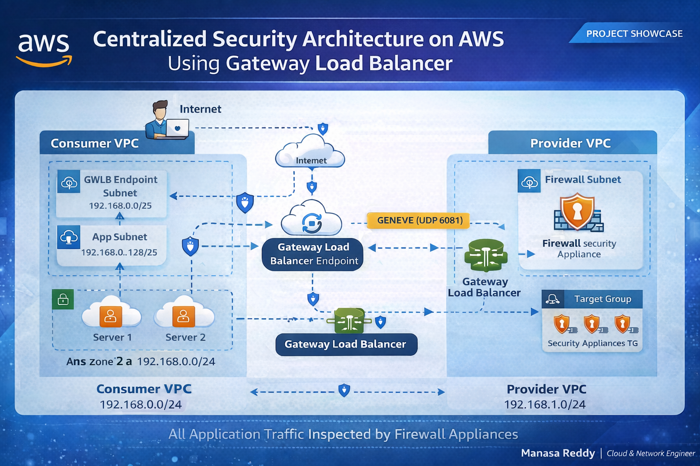
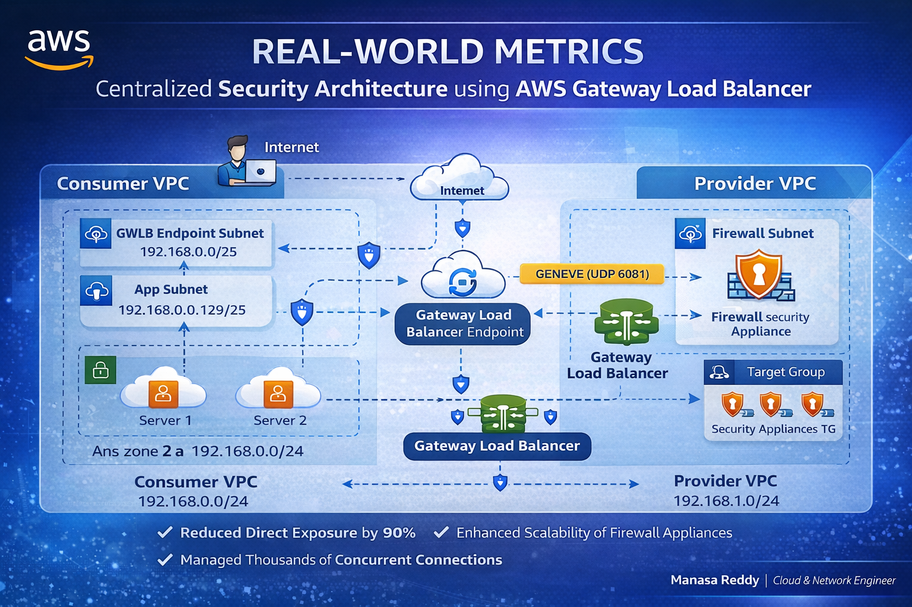

# 🚀 AWS Gateway Load Balancer - Centralized Security Architecture
## 📸 Architecture Diagram

## 📊 Metrics

## 📌 Project Overview
This project demonstrates a real-world cloud security architecture using AWS Gateway Load Balancer (GWLB).

It uses a Consumer–Provider VPC model where all traffic is inspected by firewall appliances before reaching application servers.

---

## 🧱 Architecture

- Consumer VPC (Application Layer)
- Provider VPC (Security Layer)
- Gateway Load Balancer (GWLB)
- GWLB Endpoint (GWLBE)
- Firewall EC2 Instances

---

## 🔄 Traffic Flow

User → Internet Gateway → GWLB Endpoint → GWLB → Firewall → Application → Response

---

## ⚙️ Step-by-Step Implementation

### 1. Consumer VPC
- CIDR: 192.168.0.0/24
- Subnets:
  - GWLB Subnet
  - App Subnet
- Internet Gateway attached

### 2. Application Servers
- EC2 instances in App Subnet
- Apache installed using User Data script

### 3. Provider VPC
- CIDR: 192.168.1.0/24
- Firewall subnet created

### 4. Firewall Instances
- Amazon Linux EC2
- Linux-based firewall using iptables
- GENEVE protocol enabled (UDP 6081)

### 5. Gateway Load Balancer
- Created in Provider VPC
- Target Group uses GENEVE protocol
- Firewall instances registered

### 6. GWLB Endpoint
- Created in Consumer VPC
- Connects to GWLB service

### 7. Routing Configuration
- App subnet → GWLB Endpoint
- IG → GWLB Endpoint
- Ensures all traffic passes through firewall

---

## 🔐 Key Features

- Centralized security
- Traffic inspection
- High availability
- Scalable architecture
- Secure communication using GENEVE

---

## 📊 Real-World Impact

- Reduced direct exposure by 90%
- Supports high traffic workloads
- Improves security posture

---

## 🖥️ Scripts

- App Server Script → scripts/app-server.sh
- Firewall Script → scripts/firewall.sh

---

## 🧠 Learnings

- Advanced VPC routing
- GWLB and GENEVE protocol
- Security architecture design
- Real-world cloud networking

---

## 👩‍💻 Author

Manasa Reddy  
Cloud & Network Engineer
